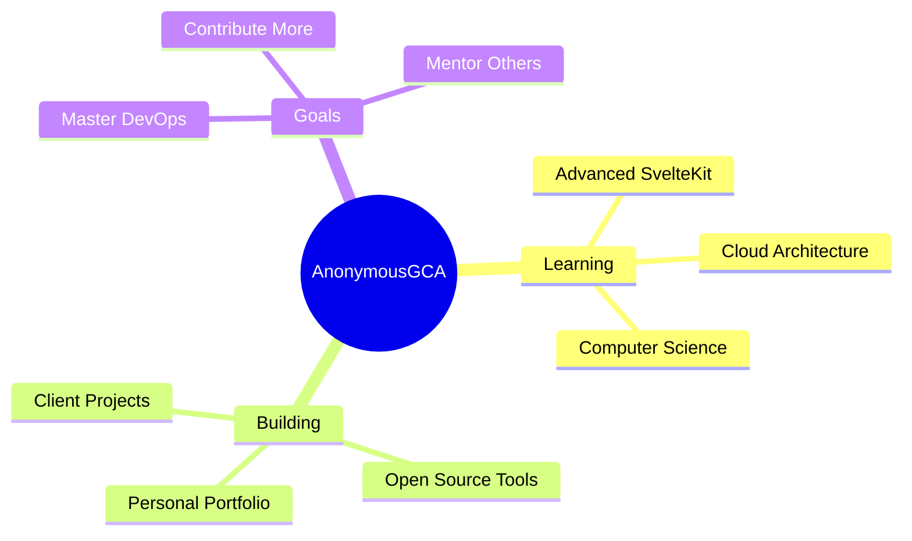

# 👋 Hello there, I'm AnonymousGCA!

<div align="center">

[](https://git.io/typing-svg)


### 🌟 Passionate Developer | 💡 Problem Solver | 🎯 Innovation Driven

[](https://discord.gg/RSp2CSuMny)
[](https://anonymousgca.eu/)
[](https://anonymousgca.eu/)

</div>

---

## 🚀 About Me

```javascript
const anonymousGCA = {
    code: ["JavaScript", "Java", "Python", "C++", "PHP", "Dart"],
    askMeAbout: ["web dev", "frontend", "backend", "svelte"],
    technologies: {
        frontend: {
            js: ["SvelteKit", "jQuery", "Bootstrap"],
            css: ["CSS3", "Bootstrap"]
        },
        backend: {
            js: ["Node.js", "Express"],
            python: ["Django"],
            java: ["Spring", "Maven", "Gradle", "JavaFX"],
            php: ["Pure PHP"]
        },
        databases: ["MySQL", "MariaDB", "PostgreSQL"],
        devOps: ["Docker", "Nginx", "Netlify", "Vercel", "Coolify", "Cloudflare"],
        tools: ["VSCode", "IntelliJ", "Postman"]
    },
    currentProject: "Building and studying at university in computer science 💼",
    funFact: "I debug with $inspect() and .log and I'm not ashamed! 🐛"
};
```

<div align="center">

## 🛠️ Tech Arsenal

### Frontend Mastery


### Backend & Database


### DevOps & Cloud


### Development Tools


### Design & Creativity


</div>

---

## 📊 GitHub Analytics

<div align="center">
  
  <br>
  <br>
  
</div>

<div align="center">
  
</div>

<div align="center">
  
</div>

---

## 🏆 GitHub Trophies

<div align="center">
  
</div>

---

## 🌟 Featured Projects

<div align="center">

### 🎭 Artigianato Online Website
[](https://github.com/GABRYCA/ArtigianatoOnline)

### 📚 School Algorithms Collection
[](https://github.com/GABRYCA/Algoritmi_scuola)

</div>

---

## 💼 Professional Services

<div align="center">

### 🎨 Custom Web Development
I create **stunning, responsive websites** tailored to your business needs!

[](https://mzeyfilms.com)
[](https://ristoranteaquazzurrasveltekit.netlify.app/)

### 💡 What I Offer:
- **Modern Web Applications** with cutting-edge technologies
- **Mobile-First Responsive Design**
- **Custom Backend Development**
- **Performance Optimization**
- **SEO-Friendly Architecture**

</div>

---

## 📈 Contribution Graph

<div align="center">
  
</div>

---

## 🎯 Current Focus

<div align="center">



</div>

---

## 💖 Support My Journey

<div align="center">

Your support fuels my passion for creating amazing digital experiences! ☕

[](https://ko-fi.com/anonymousgca)
[](https://www.paypal.com/paypalme/AnonymousGCA)
[](https://donate.stripe.com/3cscPteRbcOh716bII)

### 🤝 Let's Connect & Collaborate!

[](https://discord.gg/RSp2CSuMny)
[](mailto:anonymousgca@anonymousgca.eu)

</div>

---

<div align="center">

### 💫 "Code is like humor. When you have to explain it, it's bad." - Cory House


</div>
